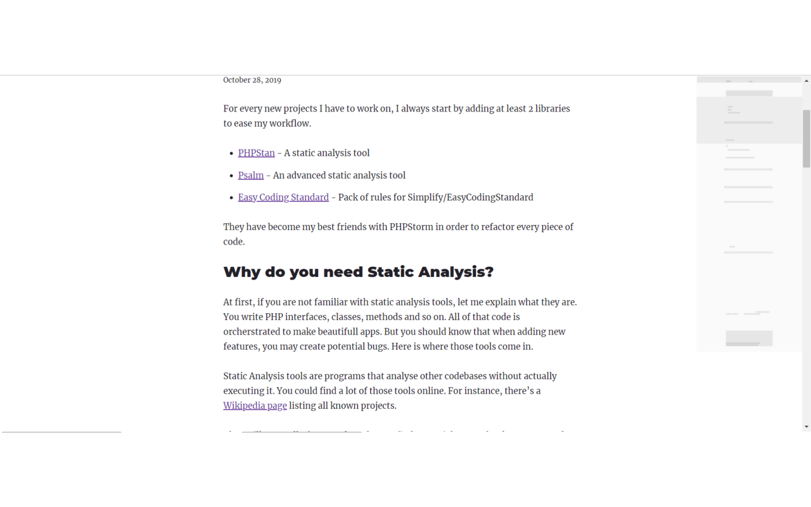

# Minimap extension 🗺️

⚠️ A simple extension to add a IDE file minimap like feature to webpages. This was only for experimenting purpose.

Here's a capture from one of my blog post about [PHP tooling for productivity](https://www.dylan-ballandras.fr/enhance-productivity-php).

I use [Pagemap library](https://larsjung.de/pagemap/) as a base for this extension.